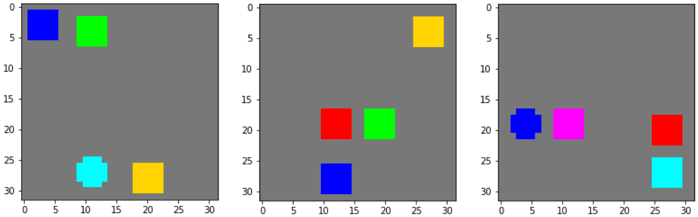

# Visual Question Answering with Sort-of-CLEVR Dataset

## 삼성 DS-KAIST AI Expert 프로그램

실습 일시: 2020년 8월 5일 (수)

담당 조교: 정종헌 (jongheonj@kaist.ac.kr), 박종진 (pjj4288@kaist.ac.kr)

## Requirements

아래의 명령어를 통해 conda 환경을 설치하고 실행할 수 있습니다. 실습 진행 시에는 이미 필요한 환경이 설치되어 있으니, `conda activate`를 통해 바로 활성화할 수 있습니다.

```
conda env create -f environment.yml
conda activate 0805_vqa
```

## Sort-of-CLEVR Dataset

**Sort-of-CLEVR**는 ["A Simple Neural Network Module for Relational Reasoning"](https://arxiv.org/abs/1706.01427)에서 처음 제시된 데이터셋으로, 2차원 평면에 임의로 배치된 사각형 혹은 원 모양의 물체들에 대한 VQA 데이터를 포함합니다. 각 물체는 모두 다른 색깔을 (red, blue, green, yellow, cyan, 또는 magenta) 가지고 있고, 특정한 색을 가지는 물체에 대한 질문 및 답변이 임의로 생성됩니다. 아래에 몇 가지 예시 이미지를 보실 수 있습니다:

<p align="center">
    
</p>

한편, 데이터셋의 각 질문은 **관계형** (relational) 및 **비관계형** (non-relational) 으로 구분될 수 있고, 미리 정의된 형태의 질문이 이진 스트링으로 인코딩되어 있습니다. 주어진 색깔에 해당하는 물체에 대해 가능한 질문의 형태는 다음과 같습니다:

**Non-relational questions**

* Is it a circle or a rectangle?
* Is it closer to the bottom of the image?
* Is it on the left of the image?

**Relational questions**

* The color of the nearest object?
* The color of the farthest object?

가능한 정답은 총 10가지로써, 이는 고정된 one-hot vector로써 표현됩니다:

*[red, blue, green, yellow, cyan, magenta, circle, rectangle, yes, no]*

## Usage

### Datasets

다음 명령어를 통해 기본 설정값에 해당하는 Sort-of-CLEVR 데이터셋을 생성할 수 있습니다:

```bash
$ python generator.py
```

한편, 데이터셋 생성 과정에서 세부적인 옵션을 (예: 이미지 속 물체의 갯수) 조정할 수도 있습니다:

```bash
$ python generator.py --num_shapes 6
```

### Training

아래 명령어를 통해 기본 베이스라인 모델의 학습을 시작할 수 있습니다:

```bash
$ python trainer.py --model baseline
```

세부적인 옵션을 조정하여 다른 모델의 학습도 가능합니다:

```bash
$ python trainer.py --model rn --dataset_path Sort-of-CLEVR_xyz
```

### Testing

학습된 모델은 `evaler.py`를 통해 test set에서의 성능을 평가할 수 있습니다:

```bash
$ python evaler.py --dataset_path Sort-of-CLEVR_default --model rn --train_dir dir
```

*train_dir* 파라미터는 ```train_dir/baseline-Sort-of-CLEVR_default_lr_0.001-20170619-040301``` 와 같은 형태를 가집니다.

## Related Work

* [A Simple Neural Network Module for Relational Reasoning](https://arxiv.org/abs/1706.01427)
* [FiLM: Visual Reasoning with a General Conditioning Layer](https://arxiv.org/abs/1709.07871)

본 프로젝트는 다음 공개 코드에 기반하여 제작되었습니다: 
* https://github.com/clvrai/Relation-Network-Tensorflow (written by Shao-Hua Sun) 


